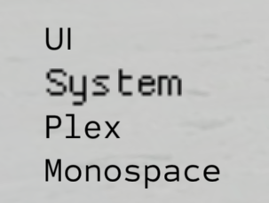
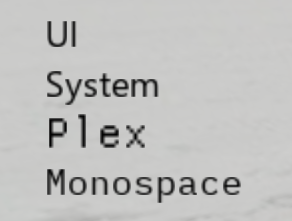

# Drawing

The **Drawing** class provides an interface for drawing shapes and text above the game window.

---

## Drawing.new

`🏛️ Constructor`

```lua
function Drawing.new(type: string): Drawing
```

Create a new drawing object of the specified type.

The possible types are 'Line', 'Text', 'Image', 'Circle', 'Square', 'Quad', and 'Triangle'.

### Parameters

 * `type` - The type of drawing object to create.

### Example

```lua
local circle = Drawing.new("Circle")
circle.Radius = 50
circle.Color = Color3.fromRGB(255, 0, 0)
circle.Filled = true
circle.NumSides = 32
circle.Position = Vector2.new(300, 300)
circle.Transparency = 0.7
circle.Visible = true

task.wait(1)
circle:Destroy()
```

---

## Drawing.Fonts

`⭕ Static` `🔒 Read-only`

```lua
Drawing.Fonts: {
	UI: 0,
	System: 1,
	Plex: 2,
	Monospace: 3,
}
```

A table containing the available font names. The style of each font varies depending on the executor.

### Fonts

<details>
<summary>Show font table</summary>

> | Executor | Fonts |
> | --------- | ----- |
> | Script-Ware |  |
> | Krnl |  |
</details>

### Example

```lua
for name, font in pairs(Drawing.Fonts) do
	local text = Drawing.new("Text")
	text.Text = "The quick brown fox (" .. name .. ")"
	text.Font = font
	text.Size = 48
	text.Position = Vector2.new(150, 100 + font * 50)
	text.Visible = true
	task.delay(2, function ()
		text:Destroy()
	end)
end
```

---

## Drawing

`🖥️ Class`

```lua
drawing = Drawing.new(type)
```

### BaseDrawing

The base class of which all drawing objects inherit. Cannot be instantiated.

| Property | Type | Description |
| -------- | ---- | ----------- |
| `Visible` | boolean | Whether the drawing is visible. Defaults to `false` on some executors. |
| `ZIndex` | number | Determines the order in which a Drawing renders relative to other drawings. |
| `Transparency` | number | The opacity of the drawing (1 is opaque, 0 is transparent). |
| `Color` | Color3 | The color of the drawing. |
| `Destroy(): ()` | function | Destroys the drawing. |

### Line

Renders a line starting at `From` and ending at `To`.

| Property | Type | Description |
| -------- | ---- | ----------- |
| `From` | Vector2 | The starting point of the line. |
| `To` | Vector2 | The ending point of the line. |
| `Thickness` | number | The thickness of the line. |

### Text

Renders text at `Position`.

| Property | Type | Description |
| -------- | ---- | ----------- |
| `Text` | string | The text to render. |
| `TextBounds` | 🔒 Vector2 | The size of the text. Cannot be set. |
| `Font` | Drawing.Font | The font to use. |
| `Size` | number | The size of the text. |
| `Position` | Vector2 | The position of the text. |
| `Center` | boolean | Whether the text should be centered horizontally. |
| `Outline` | boolean | Whether the text should be outlined. |
| `OutlineColor` | Color3 | The color of the outline. |

### Image

Draws the image data to the screen. `Data` *must* be the raw image data.

| Property | Type | Description |
| -------- | ---- | ----------- |
| `Data` | string | The raw image data. |
| `Size` | Vector2 | The size of the image. |
| `Position` | Vector2 | The position of the image. |
| `Rounding` | number | The rounding of the image. |

### Circle

Draws a circle that is centered at `Position`.

This is not a perfect circle! The greater the value for `NumSides`, the more accurate the circle will be.

| Property | Type | Description |
| -------- | ---- | ----------- |
| `NumSides` | number | The number of sides of the circle. |
| `Radius` | number | The radius of the circle. |
| `Position` | Vector2 | The position of the center of the circle. |
| `Thickness` | number | If `Filled` is false, specifies the thickness of the outline. |
| `Filled` | boolean | Whether the circle should be filled. |

### Square

Draws a rectangle starting at `Position` and ending at `Position` + `Size`.

| Property | Type | Description |
| -------- | ---- | ----------- |
| `Size` | Vector2 | The size of the square. |
| `Position` | Vector2 | The position of the top-left corner of the square. |
| `Thickness` | number | If `Filled` is false, specifies the thickness of the outline. |
| `Filled` | boolean | Whether the square should be filled. |

### Quad

Draws a four-sided figure connecting to each of the four points.

| Property | Type | Description |
| -------- | ---- | ----------- |
| `PointA` | Vector2 | The first point. |
| `PointB` | Vector2 | The second point. |
| `PointC` | Vector2 | The third point. |
| `PointD` | Vector2 | The fourth point. |
| `Thickness` | number | If `Filled` is false, specifies the thickness of the outline. |
| `Filled` | boolean | Whether the quad should be filled. |

### Triangle

Draws a triangle connecting to each of the three points.

| Property | Type | Description |
| -------- | ---- | ----------- |
| `PointA` | Vector2 | The first point. |
| `PointB` | Vector2 | The second point. |
| `PointC` | Vector2 | The third point. |
| `Thickness` | number | If `Filled` is false, specifies the thickness of the outline. |
| `Filled` | boolean | Whether the triangle should be filled. |

---

## cleardrawcache

`🌎 Global`

```lua
function cleardrawcache(): ()
```

Destroys every drawing object in the cache. Invalidates references to the drawing objects.

### Example

```lua
for i = 1, 10 do
	local circle = Drawing.new("Circle")
	circle.Radius = 50
	circle.Color = Color3.fromRGB(255, 0, 0)
	circle.Filled = true
	circle.NumSides = 32
	circle.Position = Vector2.new(math.random(300, 1200), math.random(300, 1200))
	circle.Transparency = 0.7
	circle.Visible = true
end

task.wait(1)
cleardrawcache()
```

---

## getrenderproperty

`🌎 Global`

```lua
function getrenderproperty(drawing: Drawing, property: string): any
```

Gets the value of a property of a drawing. Functionally identical to `drawing[property]`.

### Parameters

 * `drawing` - The drawing to get the property of.
 * `property` - The property to get.

### Example

```lua
local circle = Drawing.new("Circle")
getrenderproperty(circle, "Color")
```

---

## isrenderobj

`🌎 Global`

```lua
function isrenderobj(object: any): boolean
```

Returns whether the given object is a valid Drawing.

### Parameters

 * `object` - Any object.

### Example

```lua
print(isrenderobj(Drawing.new("Circle"))) --> true
print(isrenderobj({})) --> false
```

---

## setrenderproperty

`🌎 Global`

```lua
function setrenderproperty(drawing: Drawing, property: string, value: any): ()
```

Sets the value of a property of a drawing. Functionally identical to `drawing[property] = value`.

### Parameters

 * `drawing` - The drawing to set the property of.
 * `property` - The property to set.
 * `value` - The value to set the property to.

### Example

```lua
local circle = Drawing.new("Circle")
setrenderproperty(circle, "Color", Color3.fromRGB(255, 0, 0))
```